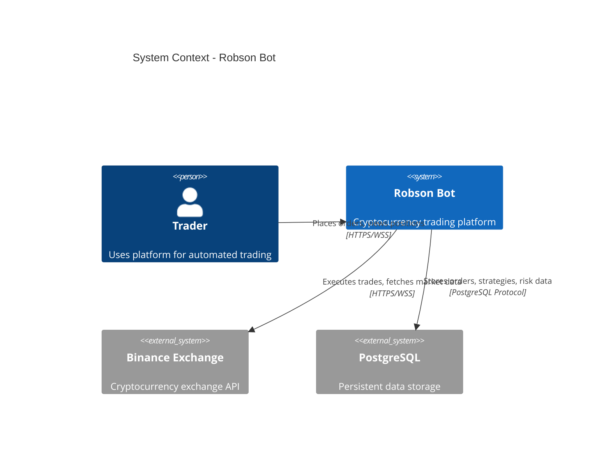
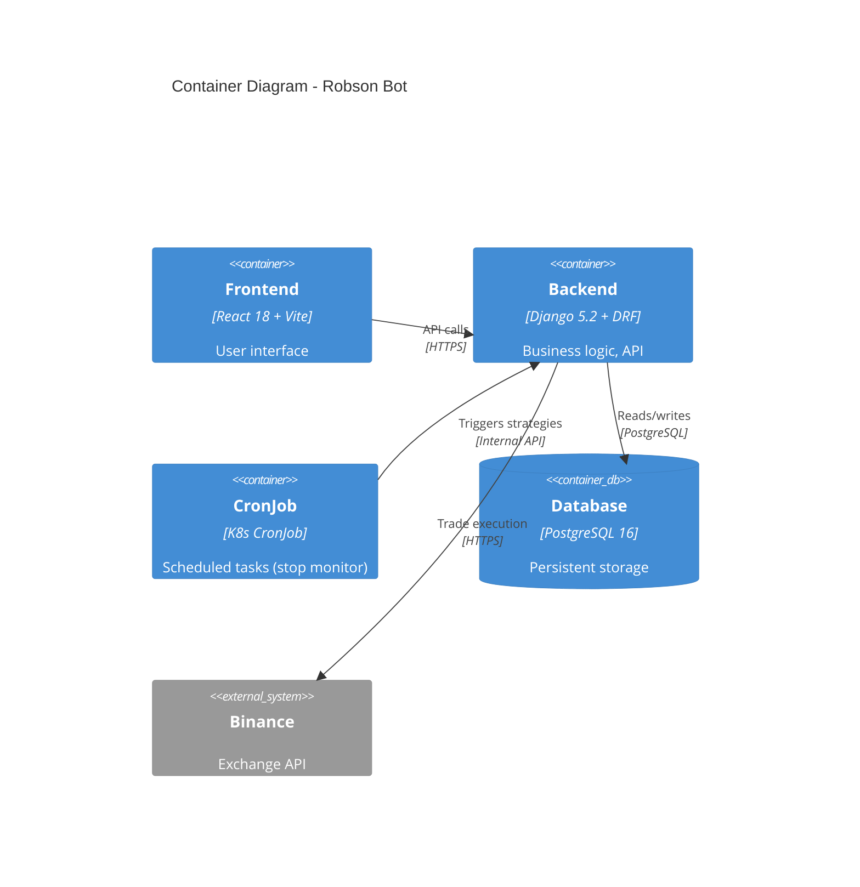
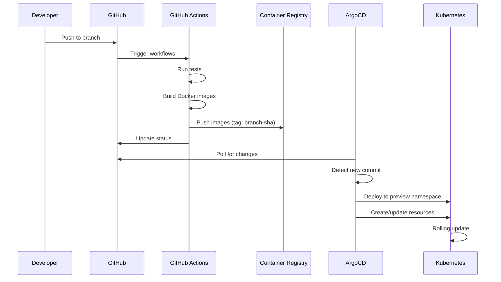

# AI Agents Guide: Robson Bot

**Comprehensive guide for AI-assisted development on Robson Bot.**

This document provides AI coding assistants (Claude, Copilot, Cursor, Cody) with complete context about the Robson Bot project, enabling effective code generation, refactoring, and problem-solving.

**Last Updated**: 2025-11-14
**Target AI Models**: Claude 3.5+, GPT-4+, Copilot, Cursor, Cody

---

## Table of Contents

1. [Project Vision & Purpose](#project-vision--purpose)
2. [High-Level Architecture](#high-level-architecture)
3. [Directory Structure](#directory-structure)
4. [Code Patterns & Conventions](#code-patterns--conventions)
5. [Testing Philosophy](#testing-philosophy)
6. [Deployment Process](#deployment-process)
7. [Domain Glossary](#domain-glossary)
8. [Key Architectural Decisions](#key-architectural-decisions)
9. [Critical Dependencies](#critical-dependencies)
10. [Common Tasks](#common-tasks)
11. [Troubleshooting Guide](#troubleshooting-guide)
12. [Performance Considerations](#performance-considerations)
13. [Security Model](#security-model)
14. [AI Collaboration Guidelines](#ai-collaboration-guidelines)

---

## Project Vision & Purpose

### What is Robson Bot?

**Robson Bot** is an **open-source cryptocurrency trading platform** that combines probabilistic analysis, technical indicators, and robust risk management to execute automated trading strategies.

**Key Features**:
- **Multi-Tenant**: Isolated trading environments for multiple users
- **Real-Time**: WebSocket connections for live market data
- **Risk Management**: Comprehensive position limits and exposure controls
- **Strategy Engine**: Pluggable trading strategies with backtesting
- **Signal Distribution**: Trading signal dissemination system
- **API-First**: RESTful API + WebSocket for all operations
- **Cloud-Native**: Kubernetes deployment with GitOps

### Mission

Democratize algorithmic trading by providing a **professional-grade, open-source platform** that rivals commercial solutions.

### Strategic Positioning

- **Open-Source**: International project, not local Brazilian tool
- **Enterprise-Grade**: Production-ready security and scalability
- **AI-First**: Optimized for AI-assisted development
- **Fintech Standards**: Compliant with Swiss fintech regulations (future)

### Company

**RBX Robótica**
- **Current**: São Paulo, Brazil
- **Future**: Zurich, Switzerland
- **Target Market**: Global cryptocurrency traders
- **Business Model**: Open-source core + enterprise features

---

## High-Level Architecture

### Architectural Style: Hexagonal (Ports & Adapters)

```
┌─────────────────────────────────────────────────────────┐
│                    Driving Adapters                      │
│   (Inbound: REST API, WebSocket, CLI, Scheduled Jobs)   │
└──────────────────────┬──────────────────────────────────┘
                       │
┌──────────────────────▼──────────────────────────────────┐
│                  Application Layer                       │
│   (Use Cases: PlaceOrder, ClosePosition, UpdateRisk)    │
│   (Ports: Interfaces for external dependencies)         │
└──────────────────────┬──────────────────────────────────┘
                       │
┌──────────────────────▼──────────────────────────────────┐
│                    Domain Layer                          │
│  (Entities: Order, Position, Strategy, Signal, Risk)    │
│  (Value Objects: Symbol, Price, Quantity, Timeframe)    │
│  (Business Logic: NO framework dependencies)            │
└──────────────────────┬──────────────────────────────────┘
                       │
┌──────────────────────▼──────────────────────────────────┐
│                   Driven Adapters                        │
│ (Outbound: Database, Exchange API, Event Bus, Cache)    │
└─────────────────────────────────────────────────────────┘
```

**Dependency Rule**: Dependencies point **inward**. Core domain has **zero** framework dependencies.

### C4 Model: System Context



### C4 Model: Container Diagram



### Technology Layers

| Layer | Technology | Purpose |
|-------|-----------|---------|
| **Frontend** | React 18, Vite, Vitest | User interface |
| **Backend** | Django 5.2, DRF 3.14 | Business logic, REST API |
| **Core** | Pure Python 3.12 | Domain entities, use cases |
| **Database** | PostgreSQL 16 | Persistent storage |
| **Cache** | (Future: Redis) | Session, real-time data |
| **Message Bus** | (Future: RabbitMQ/Kafka) | Event-driven communication |
| **Container** | Docker | Containerization |
| **Orchestration** | Kubernetes (k3s) | Deployment, scaling |
| **Service Mesh** | Istio Ambient | mTLS, traffic management |
| **GitOps** | ArgoCD | Continuous deployment |

---

## Directory Structure

```
robson/                                 # Repository root
├── apps/                               # Applications
│   ├── backend/                        # Python backend
│   │   ├── core/                       # ⭐ Hexagonal architecture center
│   │   │   ├── domain/                 # Pure entities, value objects
│   │   │   │   └── trade.py            # Order, Symbol
│   │   │   ├── application/            # Use cases, port definitions
│   │   │   │   ├── ports.py            # Interface definitions
│   │   │   │   └── place_order.py      # PlaceOrderUseCase
│   │   │   ├── adapters/               # Concrete implementations
│   │   │   │   ├── driven/             # Outbound (DB, API, messaging)
│   │   │   │   │   ├── external/       # Binance API client
│   │   │   │   │   ├── persistence/    # Django ORM repository
│   │   │   │   │   ├── messaging/      # Event bus (noop currently)
│   │   │   │   │   └── time/           # Clock abstraction
│   │   │   │   └── driving/            # Inbound (REST, WS) - TBD
│   │   │   └── wiring/                 # Dependency injection
│   │   │       └── container.py        # Use case assembly
│   │   ├── monolith/                   # ⚠️ Legacy Django app (migrating)
│   │   │   ├── api/                    # Main Django application
│   │   │   │   ├── models/             # Database models (refactored)
│   │   │   │   │   ├── base.py         # Common mixins, managers
│   │   │   │   │   ├── trading.py      # Order, Strategy, Position
│   │   │   │   │   ├── analysis.py     # Analysis models
│   │   │   │   │   ├── indicators.py   # Technical indicators
│   │   │   │   │   ├── patterns.py     # Trading patterns
│   │   │   │   │   ├── principles.py   # Risk principles
│   │   │   │   │   ├── reports.py      # Reporting models
│   │   │   │   │   ├── risk.py         # Risk models
│   │   │   │   │   ├── facts.py        # Fact models
│   │   │   │   │   ├── config.py       # Configuration
│   │   │   │   │   └── __init__.py     # Aggregates imports
│   │   │   │   ├── services/           # Service layer
│   │   │   │   │   ├── binance_service.py     # Binance singleton
│   │   │   │   │   ├── market_data_service.py # Market data
│   │   │   │   │   └── portfolio_service.py   # Portfolio calcs
│   │   │   │   ├── views/              # REST endpoints
│   │   │   │   │   ├── auth.py
│   │   │   │   │   ├── trading.py
│   │   │   │   │   ├── market.py
│   │   │   │   │   └── strategy_views.py
│   │   │   │   ├── tests/              # Tests
│   │   │   │   │   ├── test_models.py  # 1014 LOC
│   │   │   │   │   ├── test_repo_django_order.py
│   │   │   │   │   └── test_use_case_place_order.py
│   │   │   │   └── migrations/         # 8 database migrations
│   │   │   ├── backend/                # Django settings
│   │   │   │   └── settings.py         # Configuration
│   │   │   ├── requirements.txt        # 97 Python dependencies
│   │   │   └── manage.py               # Django CLI
│   │   └── cronjob/                    # Scheduled task runner
│   └── frontend/                       # React application
│       ├── src/
│       │   ├── domain/                 # Type definitions
│       │   ├── ports/                  # HTTP/WS interfaces
│       │   ├── adapters/               # Implementations
│       │   │   ├── http/               # Axios client
│       │   │   └── ws/                 # WebSocket client
│       │   ├── components/             # React components
│       │   │   ├── common/
│       │   │   └── logged/
│       │   ├── screens/                # Page components
│       │   └── App.jsx                 # Root component
│       ├── tests/                      # 2 contract tests
│       ├── package.json                # 18 dependencies
│       └── vite.config.js              # Build config
├── docs/                               # ⭐ Comprehensive documentation
│   ├── INDEX.md                        # Central navigation
│   ├── AGENTS.md                       # This file
│   ├── LANGUAGE-POLICY.md              # English-only policy
│   ├── ARCHITECTURE.md                 # Architecture overview
│   ├── DEVELOPER.md                    # Developer workflow
│   ├── adr/                            # Architecture Decision Records
│   │   ├── ADR-0001-binance-service-singleton.md
│   │   ├── ADR-0002-hexagonal-architecture.md
│   │   ├── ADR-0003-istio-ambient-gateway-api.md
│   │   ├── ADR-0004-gitops-preview-envs.md
│   │   ├── ADR-0005-ansible-bootstrap-hardening.md
│   │   └── ADR-0006-english-only-codebase.md
│   ├── specs/                          # Specifications
│   │   ├── features/                   # Feature specs
│   │   └── api/                        # API specs
│   ├── execution-plans/                # Roadmaps
│   ├── architecture/                   # Architecture docs
│   ├── runbooks/                       # Operational procedures
│   └── development/                    # Development guides
├── infra/                              # Infrastructure as Code
│   ├── ansible/                        # Node provisioning
│   ├── k8s/                            # Kubernetes manifests
│   │   ├── platform/                   # Istio, ArgoCD, cert-manager
│   │   └── gitops/                     # GitOps config
│   └── charts/                         # Helm charts
│       ├── robson-backend/
│       └── robson-frontend/
├── .github/
│   └── workflows/                      # CI/CD pipelines
│       ├── backend-tests.yml
│       ├── frontend-tests.yml
│       └── preview-images.yml
├── docker-compose.yml                  # Local development
├── Makefile                            # Development helpers
├── README.md                           # Project overview
├── CONTRIBUTING.md                     # Contribution guidelines
├── CLAUDE.md                           # Claude Code context
└── .cursorrules                        # Cursor AI rules
```

### Key Directories Explained

**`apps/backend/core/`**: Hexagonal architecture implementation
- **NO Django imports** in domain or application layers
- Pure Python business logic
- Interface-based design (ports)
- Testable without framework

**`apps/backend/monolith/`**: Legacy Django app (migration in progress)
- Still handles all REST endpoints (driving adapters pending)
- Models refactored into 10 modular files
- Service layer for business logic
- Being gradually migrated to `core/`

**`docs/`**: Comprehensive documentation
- **INDEX.md**: Central navigation hub
- **AGENTS.md**: This file - AI agent guide
- **adr/**: All architectural decisions documented
- **specs/**: TDD/BDD specifications
- **runbooks/**: Operational procedures

**`infra/`**: Infrastructure as Code
- **ansible/**: Node bootstrap (4 Contabo VPS)
- **k8s/**: Platform components (Istio, ArgoCD, cert-manager)
- **charts/**: Helm charts for backend & frontend

---

## Code Patterns & Conventions

### Language: English Only

**ALL code, comments, documentation, and commit messages MUST be in English.**

See [LANGUAGE-POLICY.md](LANGUAGE-POLICY.md) for rationale.

### Naming Conventions

| Element | Convention | Example |
|---------|-----------|---------|
| **Variables** | snake_case | `order_id`, `total_quantity` |
| **Functions** | snake_case | `place_order()`, `calculate_risk()` |
| **Classes** | PascalCase | `Order`, `PlaceOrderUseCase` |
| **Constants** | UPPER_SNAKE_CASE | `MAX_POSITION_SIZE`, `API_TIMEOUT` |
| **Private** | Leading underscore | `_internal_method()` |
| **Modules** | snake_case | `place_order.py`, `order_repository.py` |

### Python Conventions

**Type Hints** (enforced):
```python
from typing import Protocol
from decimal import Decimal

class OrderRepository(Protocol):
    def save(self, order: Order) -> Order:
        """Save order to persistent storage."""
        ...

    def find_by_id(self, order_id: str) -> Optional[Order]:
        """Retrieve order by ID."""
        ...
```

**Dataclasses for Entities**:
```python
from dataclasses import dataclass
from datetime import datetime

@dataclass(frozen=True)
class Order:
    """Immutable order entity."""
    id: str
    symbol: Symbol
    quantity: Decimal
    price: Decimal
    status: OrderStatus
    created_at: datetime
```

**Port Definitions**:
```python
from typing import Protocol

class MarketDataPort(Protocol):
    """Interface for market data access."""

    def get_current_price(self, symbol: Symbol) -> Price:
        ...

    def subscribe_to_trades(self, symbol: Symbol, callback: Callable) -> None:
        ...
```

**Use Case Pattern**:
```python
class PlaceOrderUseCase:
    """Use case for placing a new order."""

    def __init__(
        self,
        order_repo: OrderRepository,
        exchange: ExchangeExecutionPort,
        event_bus: EventBusPort,
        clock: ClockPort,
    ):
        self._order_repo = order_repo
        self._exchange = exchange
        self._event_bus = event_bus
        self._clock = clock

    def execute(self, command: PlaceOrderCommand) -> Order:
        # Validate
        # Create domain entity
        # Execute on exchange
        # Persist
        # Publish event
        # Return result
        pass
```

### Django Conventions

**Model Organization** (modular files):
```python
# apps/backend/monolith/api/models/trading.py

from apps.backend.monolith.api.models.base import TimestampedModel, TenantMixin

class Order(TimestampedModel, TenantMixin):
    """Database model for orders."""

    class Meta:
        db_table = 'orders'
        ordering = ['-created_at']

    # Fields...
```

**Service Layer**:
```python
# apps/backend/monolith/api/services/portfolio_service.py

class PortfolioService:
    """Service for portfolio calculations."""

    @staticmethod
    def calculate_total_exposure(user: User) -> Decimal:
        positions = Position.objects.filter(user=user, status='OPEN')
        return sum(p.current_value for p in positions)
```

**View Organization**:
```python
# apps/backend/monolith/api/views/trading.py

from rest_framework.decorators import api_view, permission_classes
from rest_framework.permissions import IsAuthenticated

@api_view(['POST'])
@permission_classes([IsAuthenticated])
def place_order(request):
    """Place a new trading order."""
    # Validate request
    # Call use case (when migrated)
    # Return response
    pass
```

### Frontend Conventions

**Component Structure**:
```javascript
// Functional components with hooks
import React, { useState, useEffect } from 'react';

const OrderForm = ({ onSubmit }) => {
  const [quantity, setQuantity] = useState('');

  const handleSubmit = (e) => {
    e.preventDefault();
    onSubmit({ quantity: parseFloat(quantity) });
  };

  return (
    <form onSubmit={handleSubmit}>
      {/* JSX */}
    </form>
  );
};

export default OrderForm;
```

**Ports & Adapters** (frontend):
```javascript
// src/ports/http.js
export const HttpClient = {
  get: (url, config) => Promise,
  post: (url, data, config) => Promise,
};

// src/adapters/http/axios.js
import axios from 'axios';

export const axiosHttpClient = {
  get: (url, config) => axios.get(url, config),
  post: (url, data, config) => axios.post(url, data, config),
};
```

### Commit Message Format

**Conventional Commits** (enforced):

```
<type>(<scope>): <subject>

<body>

<footer>
```

**Types**: `feat`, `fix`, `docs`, `style`, `refactor`, `test`, `chore`

**Examples**:
```
feat(trading): add stop-loss order support

Implement stop-loss order type with automatic execution
when price drops below threshold. Includes risk validation.

Closes #123
```

```
fix(api): prevent race condition in order placement

Use database transaction to ensure order atomicity.
Adds retry logic for transient exchange API failures.

Fixes #456
```

---

## Testing Philosophy

### Testing Pyramid

```
        /\
       /  \      E2E Tests (Playwright) - 5%
      /    \
     /------\    Integration Tests (API, DB) - 15%
    /        \
   /----------\  Unit Tests (Domain, Use Cases) - 80%
  /__  ____  __\
```

### Test Organization

```
tests/
├── conftest.py                 # Shared fixtures
├── unit/                       # Fast, isolated
│   ├── test_domain_entities.py
│   ├── test_use_cases.py
│   └── test_services.py
├── integration/                # Component integration
│   ├── test_django_repository.py
│   ├── test_binance_client.py
│   └── test_api_endpoints.py
├── e2e/                        # End-to-end
│   └── test_trading_workflow.py
└── fixtures/                   # Test data
    └── orders.json
```

### Testing Principles

1. **Test Domain Logic Thoroughly**: 80% coverage on core domain
2. **Integration Tests for Adapters**: Validate external integrations
3. **Contract Tests**: Ensure adapters comply with port interfaces
4. **No Tests for External Services**: Use testnet or mocks
5. **Fast Tests**: Unit tests < 10ms, integration < 100ms

### Test Patterns

**Unit Test (Domain)**:
```python
import pytest
from decimal import Decimal
from apps.backend.core.domain.trade import Order, Symbol

def test_order_creation():
    """Test creating a valid order."""
    order = Order(
        id="123",
        symbol=Symbol("BTCUSDT"),
        quantity=Decimal("0.1"),
        price=Decimal("50000"),
        status=OrderStatus.PENDING,
        created_at=datetime.now(),
    )

    assert order.symbol.value == "BTCUSDT"
    assert order.total_value == Decimal("5000")
```

**Integration Test (Repository)**:
```python
import pytest
from django.contrib.auth import get_user_model
from apps.backend.core.adapters.driven.persistence.django_order_repository import DjangoOrderRepository

@pytest.mark.django_db
def test_save_and_retrieve_order():
    """Test saving and retrieving order from database."""
    repo = DjangoOrderRepository()
    user = get_user_model().objects.create_user('test@example.com')

    order = create_test_order(user_id=user.id)
    saved = repo.save(order)

    retrieved = repo.find_by_id(saved.id)
    assert retrieved.id == saved.id
    assert retrieved.quantity == saved.quantity
```

**Contract Test (Port Compliance)**:
```python
import pytest
from apps.backend.core.application.ports import OrderRepository

def test_repository_implements_port():
    """Test that Django repository implements OrderRepository port."""
    from apps.backend.core.adapters.driven.persistence.django_order_repository import DjangoOrderRepository

    repo = DjangoOrderRepository()

    # Check all port methods exist
    assert hasattr(repo, 'save')
    assert hasattr(repo, 'find_by_id')
    assert hasattr(repo, 'find_by_user')
```

### Coverage Target

- **Overall**: 80% minimum
- **Domain Layer**: 95%+ (critical business logic)
- **Application Layer**: 90%+ (use cases)
- **Adapters**: 70%+ (integration tests sufficient)
- **Views**: 60%+ (E2E tests cover this)

### Running Tests

```bash
# Backend unit tests
cd apps/backend/monolith
python manage.py test -v 2

# With coverage
pytest --cov=apps.backend.core --cov-report=html

# Frontend tests
cd apps/frontend
npm test

# E2E tests (future)
npx playwright test
```

---

## Deployment Process

### GitOps Workflow



### Deployment Environments

| Environment | Trigger | Namespace | URL Pattern |
|-------------|---------|-----------|-------------|
| **Preview** | Any branch push | `h-<branch>` | `https://h-<branch>.preview.robsonbot.com` |
| **Staging** | Merge to `develop` | `staging` | `https://staging.robsonbot.com` |
| **Production** | Tag `v*.*.*` | `production` | `https://robsonbot.com` |

### Preview Environments

**Every branch** gets its own environment:

1. Push to branch `feature/new-indicator`
2. CI builds Docker images tagged `feature-new-indicator-abc123`
3. ArgoCD ApplicationSet detects new branch
4. Creates namespace `h-feature-new-indicator`
5. Deploys backend + frontend + PostgreSQL
6. Issues TLS certificate via cert-manager
7. Available at `https://h-feature-new-indicator.preview.robsonbot.com`

**Cleanup**: ArgoCD deletes namespace when branch is deleted.

### Manual Deployment (Emergency)

```bash
# Build and push images
docker build -f apps/backend/monolith/Dockerfile -t robson-backend:hotfix .
docker push registry.example.com/robson-backend:hotfix

# Update Helm release
cd infra/charts/robson-backend
helm upgrade robson-backend . \
  --set image.tag=hotfix \
  --namespace production

# Verify
kubectl rollout status deployment/robson-backend -n production
```

---

## Domain Glossary

### Trading Terms

| Term | Definition | Code Reference |
|------|-----------|----------------|
| **Order** | Instruction to buy/sell an asset | `apps.backend.core.domain.trade.Order` |
| **Position** | Currently held asset (open order) | `apps.backend.monolith.api.models.trading.Position` |
| **Strategy** | Trading algorithm with entry/exit rules | `apps.backend.monolith.api.models.trading.Strategy` |
| **Signal** | Generated trading recommendation | `apps.backend.monolith.api.models.trading.Signal` |
| **Symbol** | Trading pair (e.g., BTCUSDT) | `apps.backend.core.domain.trade.Symbol` |
| **Quantity** | Amount to trade | Decimal field |
| **Price** | Asset price (limit/market) | Decimal field |
| **Stop-Loss** | Automatic sell at loss threshold | Future feature |
| **Take-Profit** | Automatic sell at profit target | Future feature |

### Risk Management Terms

| Term | Definition | Code Reference |
|------|-----------|----------------|
| **Risk Profile** | User's risk tolerance (conservative/aggressive) | `apps.backend.monolith.api.models.risk.RiskProfile` |
| **Position Limit** | Max position size per trade | `apps.backend.monolith.api.models.risk.PositionLimit` |
| **Exposure** | Total capital at risk | Calculated in `PortfolioService` |
| **Leverage** | Borrowed capital multiplier | Future feature |
| **Drawdown** | Peak-to-trough decline | Analytics module |

### Technical Analysis Terms

| Term | Definition | Code Reference |
|------|-----------|----------------|
| **Indicator** | Technical analysis metric (RSI, MACD, etc.) | `apps.backend.monolith.api.models.indicators` |
| **Pattern** | Chart pattern (head & shoulders, triangle) | `apps.backend.monolith.api.models.patterns` |
| **Timeframe** | Candlestick period (1m, 5m, 1h, 1d) | String field |
| **Candlestick** | OHLC data for a period | Market data structure |
| **Volume** | Trading volume in period | Decimal field |

### Architecture Terms

| Term | Definition | Code Reference |
|------|-----------|----------------|
| **Port** | Interface definition (contract) | `apps.backend.core.application.ports` |
| **Adapter** | Implementation of a port | `apps.backend.core.adapters` |
| **Entity** | Core business object with identity | `apps.backend.core.domain` |
| **Value Object** | Immutable object with no identity | `Symbol`, `Price` |
| **Use Case** | Single business operation | `PlaceOrderUseCase` |
| **Repository** | Data access abstraction | `OrderRepository` |
| **Aggregate** | Cluster of entities (consistency boundary) | `Order` + related entities |

---

## Key Architectural Decisions

All major decisions are documented in [Architecture Decision Records](adr/):

### ADR-0001: Binance Service Singleton

**Decision**: Use singleton pattern for Binance API client
**Rationale**: Binance enforces rate limits per IP; shared client prevents violations
**Trade-off**: Singleton is anti-pattern, but practical for external API with limits

### ADR-0002: Hexagonal Architecture

**Decision**: Adopt hexagonal (ports & adapters) architecture
**Rationale**: Decouple business logic from frameworks, enable testing without Django
**Migration**: Gradual migration from monolith to hexagonal core

### ADR-0003: Istio Ambient + Gateway API

**Decision**: Use Istio Ambient Mode with Gateway API (vs. traditional Ingress)
**Rationale**: Sidecarless service mesh (lower overhead), Gateway API is future-proof
**Trade-off**: Cutting-edge tech, less mature than traditional Ingress

### ADR-0004: GitOps Preview Environments

**Decision**: Per-branch preview environments via ArgoCD ApplicationSet
**Rationale**: Enable testing in production-like environment before merge
**Benefit**: 10x faster feedback loop, reduces production bugs

### ADR-0005: Ansible Bootstrap & Hardening

**Decision**: Use Ansible for node provisioning and security hardening
**Rationale**: Repeatable, auditable infrastructure setup
**Security**: SSH hardening, UFW firewall, automated k3s installation

### ADR-0006: English-Only Codebase

**Decision**: 100% English for all technical content
**Rationale**: International positioning, AI compatibility, team scaling
**Enforcement**: Pre-commit hooks, CI checks, PR reviews

Read full ADRs in [docs/adr/](adr/).

---

## Critical Dependencies

### Backend (Python)

| Dependency | Version | Purpose | Why This Choice? |
|-----------|---------|---------|------------------|
| **Django** | 5.2 | Web framework | Mature, excellent ORM, large ecosystem |
| **DRF** | 3.14 | REST API | De facto standard for Django APIs |
| **python-binance** | 1.0.16 | Exchange integration | Official Binance Python SDK |
| **aiohttp** | 3.11 | Async HTTP | Non-blocking exchange API calls |
| **gevent** | 24.11 | Async workers | 1000 concurrent WebSocket connections |
| **pandas** | 2.1 | Data analysis | Technical indicator calculations |
| **psycopg2** | 2.9 | PostgreSQL driver | Mature, performant |
| **gunicorn** | 20.1 | WSGI server | Production-grade with gevent support |

### Frontend (JavaScript)

| Dependency | Version | Purpose | Why This Choice? |
|-----------|---------|---------|------------------|
| **React** | 18.2 | UI framework | Industry standard, huge ecosystem |
| **Vite** | 4.5 | Build tool | Fast HMR, modern, Rollup-based |
| **Vitest** | 1.6 | Testing | Vite-native, fast, Jest-compatible API |
| **Axios** | 1.1 | HTTP client | Interceptors, cancellation, mature |
| **react-router-dom** | 6.3 | Routing | Standard React routing |
| **React Bootstrap** | 2.5 | UI components | Bootstrap familiarity, accessibility |

### Infrastructure

| Dependency | Version | Purpose | Why This Choice? |
|-----------|---------|---------|------------------|
| **k3s** | Latest | Kubernetes | Lightweight, production-ready |
| **Istio** | Ambient | Service mesh | Sidecarless, automatic mTLS |
| **ArgoCD** | Latest | GitOps | Declarative deployments, rollback |
| **cert-manager** | Latest | TLS automation | Free Let's Encrypt integration |
| **Helm** | 3 | Package manager | Kubernetes standard |
| **Ansible** | Latest | Config management | Agentless, simple YAML |

---

## Common Tasks

### 1. Add a New Use Case

```bash
# 1. Define domain entity (if new)
# apps/backend/core/domain/my_entity.py

# 2. Define ports
# apps/backend/core/application/ports.py
class MyEntityRepository(Protocol):
    def save(self, entity: MyEntity) -> MyEntity: ...

# 3. Implement use case
# apps/backend/core/application/my_use_case.py
class MyUseCase:
    def __init__(self, repo: MyEntityRepository):
        self._repo = repo

    def execute(self, command: MyCommand) -> MyEntity:
        # Business logic
        pass

# 4. Implement adapter
# apps/backend/core/adapters/driven/persistence/django_my_repository.py

# 5. Wire dependencies
# apps/backend/core/wiring/container.py

# 6. Create tests
# apps/backend/monolith/api/tests/test_my_use_case.py
```

### 2. Add a New REST Endpoint

```bash
# 1. Create Django view (until driving adapters migrated)
# apps/backend/monolith/api/views/my_views.py

@api_view(['POST'])
@permission_classes([IsAuthenticated])
def my_endpoint(request):
    # Validate input
    # Call use case (from core)
    # Serialize response
    return Response(data, status=201)

# 2. Add URL route
# apps/backend/monolith/api/urls/my_urls.py
urlpatterns = [
    path('my-endpoint/', my_endpoint),
]

# 3. Update OpenAPI spec
# docs/specs/api/openapi.yaml

# 4. Create tests
# apps/backend/monolith/api/tests/test_my_endpoint.py

@pytest.mark.django_db
def test_my_endpoint_success(client, user):
    client.force_authenticate(user=user)
    response = client.post('/api/my-endpoint/', data)
    assert response.status_code == 201
```

### 3. Add Technical Indicator

```bash
# 1. Create indicator model
# apps/backend/monolith/api/models/indicators.py
class MyIndicator(TimestampedModel):
    name = models.CharField(max_length=50)
    value = models.DecimalField(max_digits=20, decimal_places=8)
    # ...

# 2. Create calculation service
# apps/backend/monolith/api/services/indicators/my_indicator.py
import pandas as pd

class MyIndicatorCalculator:
    @staticmethod
    def calculate(prices: pd.Series) -> float:
        # Calculation logic
        return result

# 3. Integrate with strategy engine
# apps/backend/monolith/api/services/strategy_service.py

# 4. Add tests
# apps/backend/monolith/api/tests/test_my_indicator.py
```

### 4. Deploy New Feature

```bash
# 1. Create feature branch
git checkout -b feature/my-feature

# 2. Implement + test
# (See above tasks)

# 3. Commit with Conventional Commits
git add .
git commit -m "feat(trading): add my feature

Implement my feature with risk validation.

Closes #123"

# 4. Push (triggers CI + preview environment)
git push origin feature/my-feature

# 5. Preview environment auto-created
# https://h-feature-my-feature.preview.robsonbot.com

# 6. Create PR on GitHub
gh pr create --title "feat: my feature" --body "Description"

# 7. Address review feedback, merge
# ArgoCD auto-deploys to production on merge to main
```

### 5. Run Local Development Environment

```bash
# 1. Start PostgreSQL
cd apps/backend/monolith
docker-compose -f docker-compose.dev.yml up -d

# 2. Apply migrations
python manage.py migrate

# 3. Create superuser
python manage.py createsuperuser

# 4. Run backend
python manage.py runserver

# 5. In new terminal, run frontend
cd apps/frontend
npm install
npm run dev

# 6. Access
# Backend: http://localhost:8000
# Frontend: http://localhost:5173
# Django Admin: http://localhost:8000/admin
```

---

## Troubleshooting Guide

### Backend Issues

**Problem**: `django.db.utils.OperationalError: could not connect to server`

**Solution**:
```bash
# Check PostgreSQL is running
docker ps | grep postgres

# Start if not running
cd apps/backend/monolith
docker-compose -f docker-compose.dev.yml up -d

# Verify connection
psql -h localhost -U robson -d robson_dev
```

**Problem**: `ModuleNotFoundError: No module named 'apps'`

**Solution**:
```bash
# Check PYTHONPATH
echo $PYTHONPATH

# Run from repository root
cd C:/app/robson
python apps/backend/monolith/manage.py runserver
```

**Problem**: Binance API rate limit exceeded

**Solution**:
```python
# Check BinanceService singleton is being used
# apps/backend/monolith/api/services/binance_service.py

# Verify testnet in development
# apps/backend/monolith/backend/settings.py
BINANCE_USE_TESTNET = config('BINANCE_USE_TESTNET', default=True, cast=bool)
```

### Frontend Issues

**Problem**: `CORS error when calling backend API`

**Solution**:
```python
# apps/backend/monolith/backend/settings.py
CORS_ALLOWED_ORIGINS = [
    "http://localhost:5173",  # Vite dev server
    "http://localhost:3000",  # Legacy port
]
```

**Problem**: WebSocket connection fails

**Solution**:
```javascript
// Check WebSocket URL in frontend
// src/adapters/ws/index.js
const WS_URL = import.meta.env.VITE_WS_URL || 'ws://localhost:8000/ws';

// Verify backend WebSocket endpoint exists
// apps/backend/monolith/api/urls/websocket.py
```

### Deployment Issues

**Problem**: ArgoCD not syncing preview environment

**Solution**:
```bash
# Check ApplicationSet
kubectl get applicationset -n argocd

# Check generated Applications
kubectl get applications -n argocd | grep h-

# Force sync
argocd app sync h-feature-my-feature

# Check logs
kubectl logs -n argocd deployment/argocd-application-controller
```

**Problem**: Pod crash loop after deployment

**Solution**:
```bash
# Check pod logs
kubectl logs -n h-feature-name pod/robson-backend-xxx

# Check events
kubectl get events -n h-feature-name --sort-by='.lastTimestamp'

# Describe pod
kubectl describe pod -n h-feature-name robson-backend-xxx

# Common issues:
# - Missing environment variables
# - Database migration failed
# - Image pull error
```

---

## Performance Considerations

### Backend Performance

**Database Queries**:
- Use `select_related()` for foreign keys (avoid N+1)
- Use `prefetch_related()` for many-to-many
- Add database indexes for frequently queried fields
- Use Django Debug Toolbar in development to identify slow queries

**Example**:
```python
# Bad (N+1 query)
orders = Order.objects.filter(user=user)
for order in orders:
    print(order.strategy.name)  # Query per iteration

# Good (1 query)
orders = Order.objects.filter(user=user).select_related('strategy')
for order in orders:
    print(order.strategy.name)  # No additional query
```

**Async Operations**:
- Use async views for I/O-bound operations (exchange API calls)
- Gevent handles concurrency for WebSocket connections
- Don't block event loop with CPU-intensive tasks

**Caching** (future):
- Cache market data (1-second TTL)
- Cache user portfolios (invalidate on trade)
- Use Redis for session storage

### Frontend Performance

**Code Splitting**:
```javascript
// Use React.lazy for route-based splitting
const Dashboard = React.lazy(() => import('./screens/Dashboard'));
```

**Memoization**:
```javascript
// Prevent unnecessary re-renders
const MemoizedComponent = React.memo(({ data }) => {
  // Expensive render
});

// Memoize expensive calculations
const totalValue = useMemo(
  () => positions.reduce((sum, p) => sum + p.value, 0),
  [positions]
);
```

**WebSocket Optimization**:
- Throttle/debounce rapid updates
- Batch updates before re-rendering
- Close connections on component unmount

### Infrastructure Performance

**Horizontal Scaling**:
- Backend: Scale replicas based on CPU/memory
- Frontend: CDN for static assets (future)
- Database: Read replicas for analytics (future)

**Resource Limits**:
```yaml
# infra/charts/robson-backend/templates/deployment.yaml
resources:
  requests:
    memory: "256Mi"
    cpu: "250m"
  limits:
    memory: "512Mi"
    cpu: "500m"
```

---

## Security Model

### Authentication

**JWT Tokens**:
- Access token (short-lived, 15 min)
- Refresh token (long-lived, 7 days)
- Stored in HTTP-only cookies (CSRF protection)

**Flow**:
1. User logs in with email/password
2. Backend validates credentials
3. Backend issues access + refresh tokens
4. Frontend includes access token in `Authorization: Bearer <token>`
5. Backend validates token on each request
6. On expiry, frontend requests new access token with refresh token

### Authorization

**Role-Based Access Control** (future):
- `admin`: Full access
- `trader`: Can trade, view own data
- `viewer`: Read-only access

**Currently**: All authenticated users have equal access (single-tenant mode).

### Data Isolation (Multi-Tenant)

**Database Level**:
- All models include `user` foreign key
- QuerySets automatically filtered by user:
  ```python
  Order.objects.filter(user=request.user)
  ```

**Future**: Row-level security in PostgreSQL for defense in depth.

### Network Security

**Istio mTLS**:
- All service-to-service communication encrypted
- Automatic certificate rotation
- Zero-trust network model

**TLS**:
- Let's Encrypt certificates via cert-manager
- Automatic renewal
- HTTPS redirect enforced

**Firewall**:
- UFW on each node (SSH, k3s ports only)
- Kubernetes NetworkPolicies (future)

### Secrets Management

**Current**: Kubernetes Secrets (base64 encoded, not encrypted)

**Future**: SealedSecrets or SOPS for encrypted secrets in Git

**Best Practices**:
- Never commit secrets to Git
- Use `.env.example` templates
- Rotate secrets quarterly
- Audit secret access

---

## AI Collaboration Guidelines

### Critical Rules for AI Assistants

1. **English Only**: All code, comments, docs in English
2. **Hexagonal Architecture**: New code goes in `core/`, follows ports & adapters
3. **Type Hints**: Always use type hints in Python
4. **Tests First**: Write tests before implementation when possible
5. **Conventional Commits**: Follow commit message format
6. **No Framework in Domain**: `core/domain/` has zero Django imports
7. **Port-Based**: Define ports before adapters
8. **Immutable Entities**: Use `@dataclass(frozen=True)` for domain entities

### When Generating Code

**DO**:
- ✅ Use existing patterns from codebase
- ✅ Follow hexagonal architecture for new features
- ✅ Add comprehensive docstrings
- ✅ Include type hints
- ✅ Write tests alongside code
- ✅ Update OpenAPI spec for new endpoints
- ✅ Create ADR for significant decisions

**DON'T**:
- ❌ Mix Portuguese and English
- ❌ Import Django in `core/domain/` or `core/application/`
- ❌ Create new patterns without discussing
- ❌ Skip tests
- ❌ Ignore existing conventions
- ❌ Add dependencies without justification

### When Answering Questions

**Provide**:
- Specific file paths (e.g., `apps/backend/core/domain/trade.py:42`)
- Code examples from actual codebase
- Links to relevant ADRs or docs
- Step-by-step instructions

**Avoid**:
- Generic advice not specific to Robson Bot
- Assumptions about project structure
- Recommending patterns that conflict with hexagonal architecture

### Useful Context Files

When you need context, refer to:
- [ARCHITECTURE.md](ARCHITECTURE.md) - Architecture overview
- [ADRs](adr/) - Architectural decisions
- [DEVELOPER.md](DEVELOPER.md) - Development workflow
- [Specs](specs/) - Feature specifications
- [This file](AGENTS.md) - Comprehensive guide

---

## Quick Reference: File Path Patterns

| Task | File Path Pattern |
|------|-------------------|
| **Add domain entity** | `apps/backend/core/domain/*.py` |
| **Add use case** | `apps/backend/core/application/*.py` |
| **Add port** | `apps/backend/core/application/ports.py` |
| **Add adapter** | `apps/backend/core/adapters/driven/*/*.py` |
| **Add Django model** | `apps/backend/monolith/api/models/*.py` |
| **Add Django view** | `apps/backend/monolith/api/views/*.py` |
| **Add service** | `apps/backend/monolith/api/services/*.py` |
| **Add test** | `apps/backend/monolith/api/tests/test_*.py` |
| **Add React component** | `apps/frontend/src/components/*/*.jsx` |
| **Add frontend test** | `apps/frontend/tests/*.test.js` |
| **Add ADR** | `docs/adr/ADR-XXXX-*.md` |
| **Add spec** | `docs/specs/features/*.spec.md` |
| **Add runbook** | `docs/runbooks/*.md` |

---

## Conclusion

This guide provides AI assistants with comprehensive context about Robson Bot. Use it as your primary reference when:

- Generating code
- Answering questions
- Suggesting refactorings
- Debugging issues
- Proposing new features

**Remember**: Quality > Speed. Take time to understand the context, follow the patterns, and deliver professional code.

**Questions?** Refer to [docs/INDEX.md](INDEX.md) for additional documentation.

---

**Maintained by**: Robson Bot Core Team
**Last Updated**: 2025-11-14
**Version**: 1.0
