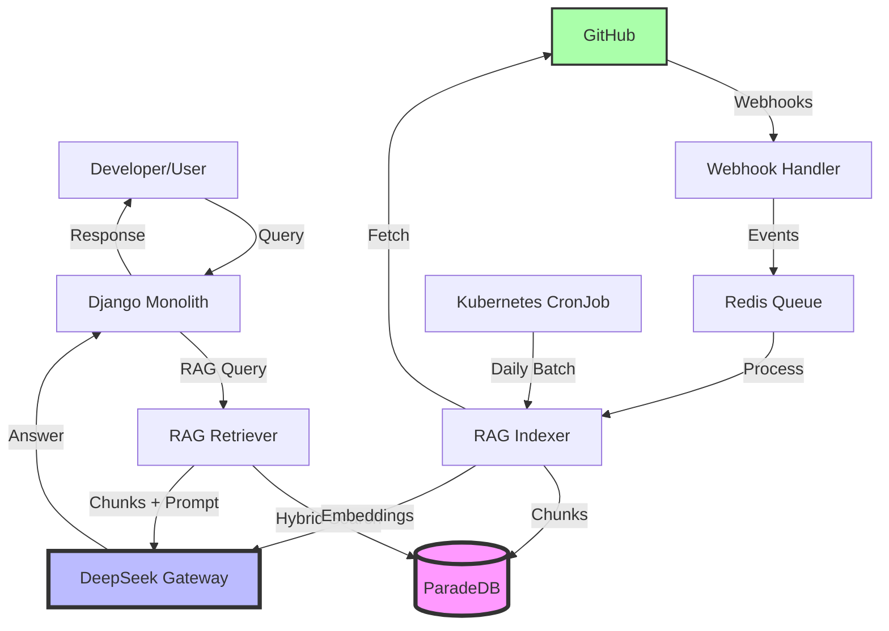

# AI-First Architecture Overview

**Last Updated**: 2025-12-07
**Status**: Proposed
**Related ADRs**: ADR-0007, ADR-0008, ADR-0009, ADR-0010

---

## Vision

Transform Robson Bot into an **AI-First trading platform** where:
- Developers query project knowledge via natural language (RAG-powered).
- Trading strategies are analyzed and recommended by LLMs.
- Code generation and refactoring are LLM-assisted.
- All AI capabilities are **self-hosted** for privacy, cost control, and sovereignty.

---

## Architecture Diagram



---

## Components

### 1. **ParadeDB** (Knowledge Store)
- **Role**: Unified database for Django ORM (OLTP) + RAG knowledge (search).
- **Extensions**: `pg_search` (BM25), `pgvector` (dense vectors).
- **Schema**: `rag_knowledge_entries` table (docs/ai-first/SQL_SCHEMA.md).
- **ADR**: ADR-0007

### 2. **DeepSeek Gateway** (LLM Service)
- **Role**: Self-hosted LLM inference for answer generation and embeddings.
- **Model**: DeepSeek-R1-Distill-Qwen-1.5B (upgradable).
- **API**: REST (`/v1/completions`, `/v1/embeddings`) compatible with OpenAI spec.
- **Deployment**: Kubernetes Deployment (CPU-only, 8GB RAM).
- **ADR**: ADR-0008

### 3. **RAG Indexer** (Ingestion Pipeline)
- **Role**: Ingest GitHub data (PRs, issues, docs) and index into ParadeDB.
- **Triggers**: Webhooks (real-time) + CronJob (daily batch).
- **Processing**: Fetch → Clean → Chunk → Embed → Store.
- **Idempotency**: Upsert by `source_type + source_id`.
- **ADR**: ADR-0010

### 4. **RAG Retriever** (Query Engine)
- **Role**: Answer user queries by retrieving relevant chunks and prompting DeepSeek.
- **Flow**: User query → BM25 + vector search → rank → top-K → augment prompt → DeepSeek → answer.
- **Endpoint**: `POST /api/v1/knowledge/query`.
- **ADR**: ADR-0009

### 5. **GitHub** (Source of Truth)
- **Role**: Canonical source for PRs, issues, docs, code.
- **Integration**: Webhooks + REST API.
- **Data Flow**: GitHub → Webhooks/Batch → Indexer → ParadeDB.

---

## Data Flow

### **Ingestion Flow**
1. **GitHub Event**: PR merged, issue closed, doc pushed.
2. **Webhook**: GitHub sends payload to `/api/v1/webhooks/github`.
3. **Queue**: Event queued in Redis (async processing).
4. **Indexer**: Dequeue event, fetch content, chunk, embed, write to ParadeDB.
5. **Storage**: Chunks stored in `rag_knowledge_entries` with BM25 + vector indexes.

### **Query Flow**
1. **User Query**: Developer asks "How do I add a new strategy?".
2. **API Request**: Frontend sends `POST /api/v1/knowledge/query`.
3. **Retrieval**: RAG retriever executes hybrid search (BM25 + vector) on ParadeDB.
4. **Ranking**: Top-K chunks selected (K=5).
5. **Prompt Construction**: Chunks + query inserted into prompt template.
6. **LLM Generation**: DeepSeek gateway generates answer (streaming).
7. **Response**: Answer + source citations returned to user.

---

## Technology Stack

| Component | Technology | Rationale |
|-----------|-----------|-----------|
| **Database** | ParadeDB (PostgreSQL + pg_search + pgvector) | Unified OLTP + search, hybrid search, ACID guarantees |
| **LLM** | DeepSeek-R1-Distill-Qwen-1.5B | CPU-friendly, strong reasoning, open weights |
| **Backend** | Django 5.2 + Python 3.12 | Existing monolith, hexagonal architecture |
| **Queue** | Redis + Celery | Async webhook processing, task queue |
| **Embeddings** | DeepSeek embeddings (768-dim) | Consistent with LLM, self-hosted |
| **Orchestration** | Kubernetes (k3s) | Existing deployment platform |
| **GitOps** | ArgoCD | Existing CD pipeline |

---

## Deployment Topology

```
k3s Cluster (Contabo VPS)
├── Namespace: production
│   ├── Deployment: backend-monolith (Django)
│   ├── Deployment: deepseek-gateway (LLM)
│   ├── StatefulSet: paradedb (Database)
│   ├── Deployment: rag-indexer (Ingestion)
│   ├── Service: redis (Queue)
│   └── CronJob: rag-batch-indexer (Daily)
├── Namespace: istio-system
│   └── Istio Ambient (mTLS, Gateway API)
└── Namespace: argocd
    └── ArgoCD (GitOps)
```

---

## Resource Allocation (Contabo VPS - 32GB RAM, 8 vCPUs)

| Component | CPU | Memory | Disk | Notes |
|-----------|-----|--------|------|-------|
| **ParadeDB** | 2 cores | 8GB | 50GB SSD | Shared OLTP + search |
| **DeepSeek Gateway** | 4 cores | 8GB | 10GB (model) | CPU inference |
| **Django Monolith** | 1 core | 4GB | - | Existing workload |
| **RAG Indexer** | 0.5 cores | 2GB | - | Batch + webhooks |
| **Redis** | 0.5 cores | 1GB | 5GB | Queue + cache |
| **System Overhead** | 1 core | 9GB | - | OS, k3s, Istio |
| **Total** | 9 cores | 32GB | 65GB | Slightly over-provisioned (bursting OK) |

---

## Security Considerations

1. **API Authentication**:
   - RAG endpoints require JWT (existing Django auth).
   - Webhook endpoint validates GitHub HMAC signature.

2. **Data Privacy**:
   - No GitHub data sent to external APIs (DeepSeek is self-hosted).
   - Sensitive patterns (`.env`, `credentials.json`) filtered during indexing.

3. **Rate Limiting**:
   - RAG queries throttled (10 req/min per user) to prevent abuse.
   - DeepSeek gateway limited to 5 concurrent requests (resource constraints).

4. **Secrets Management**:
   - GitHub API token, webhook secret stored in Kubernetes Secrets.
   - DeepSeek model weights pulled from Hugging Face (public repo).

---

## Monitoring & Observability

### **Metrics** (Prometheus)
- **Indexing**: `rag_chunks_indexed_total`, `rag_ingestion_lag_seconds`.
- **Retrieval**: `rag_query_latency_seconds` (p50, p95, p99), `rag_queries_total`.
- **LLM**: `deepseek_tokens_per_second`, `deepseek_request_latency_seconds`.
- **Database**: ParadeDB query latency, connection pool utilization.

### **Logs** (Loki/Fluentd)
- Indexer: Event payloads (sanitized), errors, retries.
- Retriever: Queries, top-K chunks, answer quality feedback.
- DeepSeek: Prompt inputs (sanitized), generation time, fallback triggers.

### **Alerts** (Alertmanager → Slack)
- Ingestion lag >2 hours.
- DeepSeek latency >5s (p95).
- ParadeDB disk usage >80%.
- GitHub API rate limit approaching.

---

## Migration Strategy

### **Phase 1: Infrastructure** (Week 1-2)
- Deploy ParadeDB StatefulSet.
- Migrate Django to ParadeDB (verify ORM compatibility).
- Deploy DeepSeek gateway (test inference).

### **Phase 2: Indexing** (Week 3-4)
- Implement RAG indexer (webhook + batch).
- Backfill last 12 months of PRs/issues/docs.
- Validate index quality (sample queries).

### **Phase 3: Retrieval** (Week 5-6)
- Implement RAG retriever (hybrid search).
- Build API endpoint (`/api/v1/knowledge/query`).
- Integrate with DeepSeek gateway.

### **Phase 4: Production** (Week 7-8)
- Enable in production (beta flag for select users).
- Monitor metrics, gather feedback.
- Iterate on chunk size, retrieval strategy, prompt templates.

---

## Success Metrics

| Metric | Target | How to Measure |
|--------|--------|----------------|
| **Query Latency** | <2s (p95) | Prometheus `rag_query_latency_seconds` |
| **Indexing Freshness** | <1 hour lag | Prometheus `rag_ingestion_lag_seconds` |
| **Answer Quality** | >80% thumbs-up | User feedback in UI |
| **Developer Adoption** | 50+ queries/week | Django logs, analytics |
| **Cost Reduction** | $0 external API spend | Zero OpenAI/Anthropic bills |

---

## Future Enhancements

1. **Re-ranking**: Add cross-encoder model for top-K re-ranking (improve precision).
2. **Multi-modal**: Index diagrams (CLIP embeddings) and images (OCR).
3. **Fine-tuning**: Fine-tune DeepSeek on Robson-specific data (trading domain).
4. **Multi-repo**: Index dependencies (e.g., `python-binance` docs).
5. **Agentic RAG**: Multi-step reasoning (e.g., "compare two strategies" → retrieve both → compare).

---

## References

- **ADRs**: docs/adr/ADR-0007 to ADR-0010
- **SQL Schema**: docs/ai-first/SQL_SCHEMA.md
- **Event Format**: docs/ai-first/INGESTION_EVENTS.md
- **Gateway Protocol**: docs/ai-first/DEEPSEEK_GATEWAY.md
- **Execution Plans**: docs/plan/*.prompt

---

**Maintainers**: Robson Bot Core Team
**License**: Same as project
