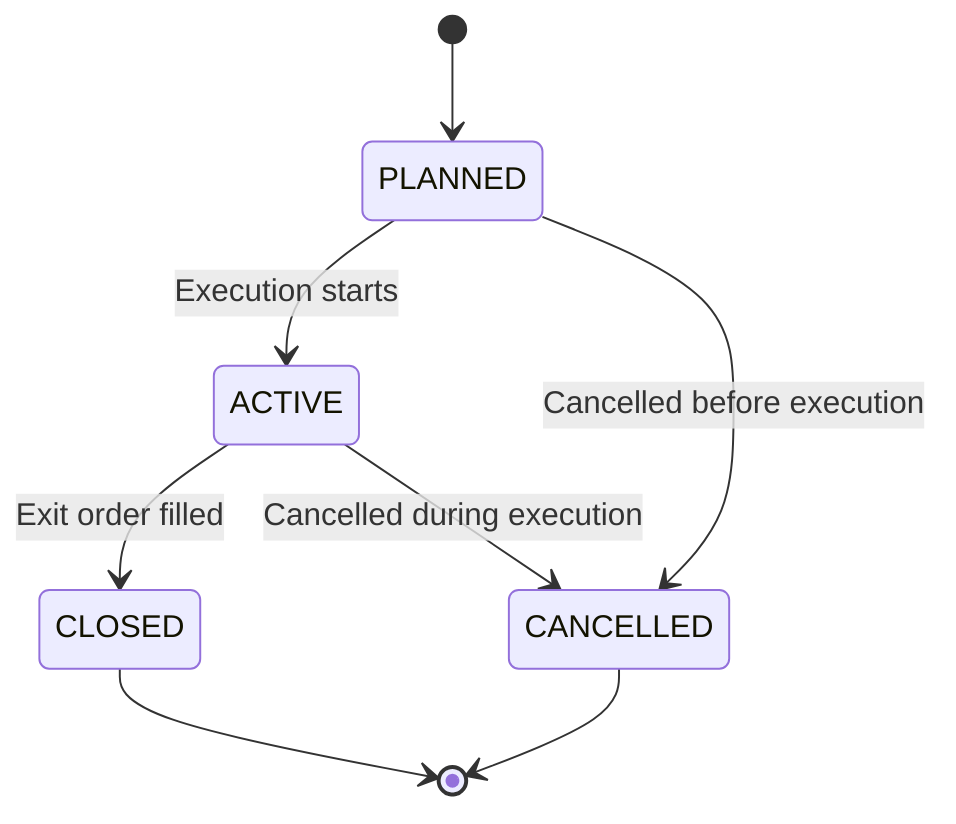

# Operation Lifecycle State Machine

**Gate 5**: Minimal lifecycle updates for Operation status based on synchronous outcomes in LIVE execution.

## Overview

The `Operation` model follows a strict state machine to ensure data integrity and prevent invalid state transitions. This document describes the allowed transitions and the guardrails in place.

**Important**: This document describes status transition validation only. Tenant isolation is enforced at the query/view layer, not by `Operation.set_status()`.

## Status States

| Status | Description | Terminal |
|--------|-------------|----------|
| `PLANNED` | Initial state for manual/legacy operations | No |
| `ACTIVE` | Operation is live and actively trading | No |
| `CLOSED` | Operation completed successfully (exit order filled) | Yes |
| `CANCELLED` | Operation was cancelled before completion | Yes |

## State Machine Diagram



## Allowed Transitions

### Forward Transitions (Allowed)

| From | To | Use Case |
|------|-----|----------|
| `PLANNED` | `ACTIVE` | Operation starts execution |
| `PLANNED` | `CANCELLED` | Cancelled before execution |
| `ACTIVE` | `CLOSED` | Exit order successfully filled (stop/target or manual close) |
| `ACTIVE` | `CANCELLED` | Cancelled during execution |

### Terminal States (No Exits)

- `CLOSED`: Operation completed, cannot be reopened
- `CANCELLED`: Operation cancelled, cannot be resumed

### Backward Transitions (Rejected)

| From | To | Reason |
|------|-----|--------|
| `CLOSED` | `ACTIVE` | Cannot reopen completed operations |
| `CANCELLED` | `ACTIVE` | Cannot resume cancelled operations |
| `CLOSED` | `CANCELLED` | Terminal to terminal not allowed |
| `CANCELLED` | `CLOSED` | Terminal to terminal not allowed |

## Implementation

### Domain Guardrails

All status transitions MUST use `Operation.set_status()` method:

```python
operation.set_status("CLOSED")
operation.save()
```

Direct field assignment is **NOT recommended**:
```python
# BAD: Bypasses validation
operation.status = "CLOSED"
operation.save()
```

### Error Handling

Invalid transitions raise `InvalidOperationStatusError` with a machine-readable format:

```python
from api.models.trading import InvalidOperationStatusError

# Invalid transition
try:
    operation.set_status("ACTIVE")  # When operation.status == "CLOSED"
except InvalidOperationStatusError as e:
    print(f"Invalid transition: {e}")
    # Output: Invalid status transition: current=CLOSED, new=ACTIVE, allowed=(none)

# Invalid status value
try:
    operation.set_status("FOOBAR")
except InvalidOperationStatusError as e:
    print(f"Invalid value: {e}")
    # Output: Invalid status value: 'FOOBAR'. Valid statuses: ACTIVE, CANCELLED, CLOSED, PLANNED
```

### Implementation Details

The `Operation.set_status()` method:
1. Validates that `new_status` is a valid value from `STATUS_CHOICES`
2. Validates that the transition is allowed from the current state
3. Assigns the new status to `self.status`
4. Does **NOT** call `save()` - caller must persist explicitly

This design ensures:
- Separation of concerns (validation vs persistence)
- Flexibility for callers to manage transaction boundaries
- Testability without side effects

## Existing Close Flows (Gate 5)

### 1. Stop Monitor (Automated)

**File**: `api/application/stop_monitor.py:429`

Triggered when stop-loss or take-profit is hit. The operation mutation is wrapped in `transaction.atomic()`:

```python
# Link exit order and update status (atomic)
with transaction.atomic():
    operation.exit_orders.add(exit_order)
    operation.set_status("CLOSED")
    operation.save()
```

### 2. Manual Close Position (CLI)

**File**: `api/management/commands/close_position.py:204`

Manual position closure via CLI:

```bash
python manage.py close_position --operation-id 123
```

Code with atomic wrapper:
```python
# Link exit order and update status (atomic)
with transaction.atomic():
    op.exit_orders.add(exit_order)
    op.set_status("CLOSED")
    op.save()
```

### 3. LIVE Execution (Creation)

**File**: `api/application/execution_framework.py:242`

Operations are created directly as `ACTIVE` in LIVE execution (bypassing `PLANNED`):
```python
operation = Operation.objects.create(
    ...
    status="ACTIVE",  # Immediately ACTIVE (no pending state in Gate 4)
    ...
)
```

## Testing

See `api/tests/test_models.py::TestOperationLifecycle` for comprehensive test coverage:

- Allowed transitions (4 tests)
- Rejected backward transitions (4 tests)
- Invalid status values (1 test)
- Persistence after save (1 test)

**10 tests total** (cross-tenant tests belong at view/query layer, not model)

Run tests:
```bash
cd apps/backend/monolith
DJANGO_SETTINGS_MODULE=backend.settings .venv/bin/python -m pytest \
    api/tests/test_models.py::TestOperationLifecycle -v
```

## Invariants

1. **No Backward Transitions**: Terminal states (`CLOSED`, `CANCELLED`) cannot transition to active states
2. **Status Value Validation**: Only valid status values from `STATUS_CHOICES` are accepted
3. **Transactional Safety**: Status updates should be wrapped in `transaction.atomic()` when combined with related mutations
4. **Synchronous Only**: Gate 5 only supports synchronous status updates within request/response cycles

**Note on Tenant Isolation**: Tenant boundaries are enforced at the query and view layers, not by `Operation.set_status()`. The model method only validates status transitions; it does not check tenant ownership.

## Future Scope (NOT in Gate 5)

The following are **explicitly out of scope** for Gate 5:

- WebSocket-based status updates
- Background polling of order status
- Scheduled status reconciliation
- RabbitMQ/async event propagation
- New REST endpoints for status updates
- CANCEL status flow implementation (guardrails only)

## Related Documentation

- [Transaction Hierarchy](./TRANSACTION-HIERARCHY.md) - Operation in L2 hierarchy
- [Gate 4 Implementation](../specs/gate-4-operation-creation.md) - Operation creation semantics
- [ADR-0007](../adr/ADR-0007-trading-intent.md) - Agentic workflow

---

**Last Updated**: 2025-01-01 (Gate 5)
**See Also**: `api/models/trading.py:Operation.set_status()`
