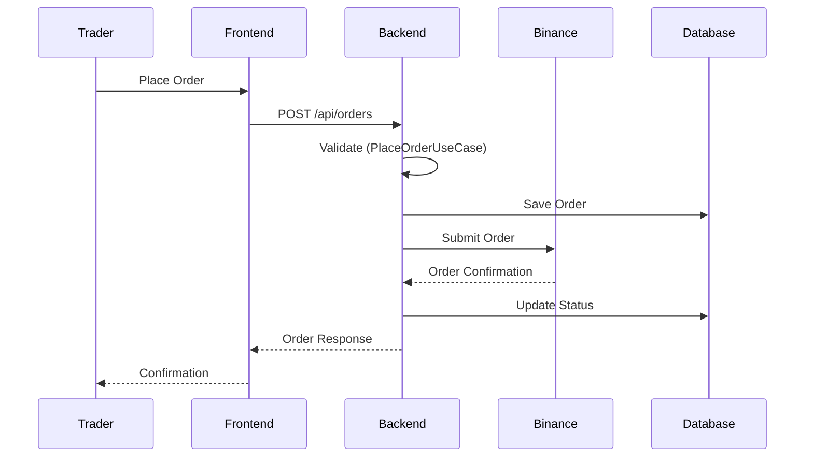

# Architecture Documentation

**Technical architecture and system design documentation for Robson Bot.**

## Purpose

This directory contains:
- **System Architecture**: High-level system design (C4 Model)
- **Data Flow**: How data moves through the system
- **Tech Stack**: Technology choices and rationale
- **Security Model**: Security architecture and controls
- **Deployment**: Kubernetes deployment architecture
- **Diagrams**: Visual representations (Mermaid format)

## Structure

```
architecture/
├── README.md
├── system-overview.md      # C4 Model Level 1-2
├── data-flow.md            # Data flow diagrams
├── tech-stack.md           # Technology stack
├── security-model.md       # Security architecture
├── deployment.md           # K8s deployment architecture
└── diagrams/               # Mermaid diagram files
    ├── README.md
    └── c4-context.mmd
```

## Quick Navigation

### For New Team Members

Start here to understand the system:

1. **[System Overview](system-overview.md)** - High-level architecture
2. **[Tech Stack](tech-stack.md)** - Technologies we use and why
3. **[Data Flow](data-flow.md)** - How data moves through the system

### For Security Review

- **[Security Model](security-model.md)** - Security controls and threat model
- **[Deployment Architecture](deployment.md)** - Network topology and isolation

### For Operations

- **[Deployment Architecture](deployment.md)** - K8s manifests and configuration
- **[../runbooks/](../runbooks/)** - Operational procedures

## Architecture Principles

Our architecture follows these principles:

### 1. Hexagonal Architecture (Ports & Adapters)

- **Core Domain**: Pure business logic, no framework dependencies
- **Ports**: Interface definitions for external interactions
- **Adapters**: Concrete implementations (database, APIs, messaging)
- **Dependency Rule**: Dependencies point inward (core has no dependencies)

See [../ARCHITECTURE.md](../ARCHITECTURE.md) for details.

### 2. Domain-Driven Design

- **Bounded Contexts**: Trading, Risk Management, Market Data, Signals
- **Ubiquitous Language**: Consistent terminology across code and docs
- **Aggregates**: Order, Position, Strategy, Signal
- **Events**: Domain events for async communication

### 3. API-First Design

- **OpenAPI Specification**: REST API contract defined first
- **AsyncAPI Specification**: WebSocket/event contracts
- **Contract Testing**: Validate implementations against specs
- **Documentation**: Auto-generated from specs

### 4. Multi-Tenant Isolation

- **Data Isolation**: Tenant-scoped queries at ORM level
- **Resource Limits**: Namespace-level quotas in Kubernetes
- **Security**: Row-level security in PostgreSQL (future)
- **Metrics**: Per-tenant observability

### 5. Cloud-Native

- **Containerized**: All services run in Docker containers
- **Orchestrated**: Kubernetes for deployment and scaling
- **Observable**: Structured logging, metrics, and traces
- **Resilient**: Health checks, circuit breakers, retries

## C4 Model

We use the [C4 model](https://c4model.com/) for architecture diagrams:

### Level 1: System Context

Shows Robson Bot in relation to users and external systems.

See [system-overview.md#context](system-overview.md#context).

### Level 2: Container Diagram

Shows the high-level technology containers (web app, database, etc.).

See [system-overview.md#containers](system-overview.md#containers).

### Level 3: Component Diagram

Shows components within containers (for backend services).

See [system-overview.md#components](system-overview.md#components).

### Level 4: Code

Shown through class diagrams in implementation docs.

## Key Architectural Decisions

Major decisions are documented in ADRs:

| Decision | ADR | Status |
|----------|-----|--------|
| Hexagonal Architecture | [ADR-0002](../adr/ADR-0002-hexagonal-architecture.md) | Accepted |
| Binance Service Singleton | [ADR-0001](../adr/ADR-0001-binance-service-singleton.md) | Accepted |
| Istio Ambient + Gateway API | [ADR-0003](../adr/ADR-0003-istio-ambient-gateway-api.md) | Accepted |
| GitOps Preview Environments | [ADR-0004](../adr/ADR-0004-gitops-preview-envs.md) | Accepted |
| Ansible Bootstrap | [ADR-0005](../adr/ADR-0005-ansible-bootstrap-hardening.md) | Accepted |

See [../adr/](../adr/) for all ADRs.

## Technology Stack

| Layer | Technology | Rationale |
|-------|-----------|-----------|
| **Backend** | Django 5.2 + DRF | Mature framework, excellent ORM, large ecosystem |
| **Frontend** | React 18 + Vite | Modern, performant, great developer experience |
| **Database** | PostgreSQL 16 | ACID compliance, JSON support, mature |
| **Async** | Gevent + aiohttp | Non-blocking I/O for high concurrency |
| **Container** | Docker | Standard containerization |
| **Orchestration** | Kubernetes (k3s) | Production-grade, cloud-native |
| **Service Mesh** | Istio Ambient | Sidecarless, automatic mTLS |
| **Ingress** | Gateway API | Future-proof, Kubernetes standard |
| **GitOps** | ArgoCD | Declarative, auditable deployments |

See [tech-stack.md](tech-stack.md) for complete details.

## Data Flow

### Trading Workflow



See [data-flow.md](data-flow.md) for all flows.

## Security Architecture

### Defense in Depth

1. **Network**: Istio mTLS between services
2. **Transport**: TLS 1.3 for external traffic (Let's Encrypt)
3. **Authentication**: JWT tokens with refresh
4. **Authorization**: Role-based access control
5. **Data**: PostgreSQL encryption at rest (future)
6. **Secrets**: Kubernetes secrets (SealedSecrets planned)

See [security-model.md](security-model.md) for threat model and controls.

## Deployment Architecture

### Kubernetes Topology

```
┌─────────────────────────────────────────────────────┐
│ Istio Gateway (Gateway API)                         │
│ ├─ TLS Termination (cert-manager)                   │
│ └─ HTTP Routing (HTTPRoute)                         │
└──────────────────┬──────────────────────────────────┘
                   │
       ┌───────────┴────────────┐
       │                        │
┌──────▼──────┐        ┌────────▼────────┐
│ Backend     │        │ Frontend        │
│ Deployment  │        │ Deployment      │
│ (3 replicas)│        │ (2 replicas)    │
└──────┬──────┘        └─────────────────┘
       │
┌──────▼──────┐
│ PostgreSQL  │
│ StatefulSet │
│ (1 replica) │
└─────────────┘
```

See [deployment.md](deployment.md) for complete details.

## Diagrams

All diagrams use **Mermaid** format for version control and easy editing.

See [diagrams/](diagrams/) directory.

### Editing Diagrams

1. Use VS Code with Mermaid Preview extension
2. Live preview: `Ctrl+Shift+V`
3. Commit `.mmd` files, not images
4. Auto-render in GitHub and documentation sites

## Related Documentation

- **High-Level**: [../ARCHITECTURE.md](../ARCHITECTURE.md)
- **API Specs**: [../specs/api/](../specs/api/)
- **Runbooks**: [../runbooks/](../runbooks/)
- **ADRs**: [../adr/](../adr/)

## Contributing

When updating architecture:

1. Update relevant `.md` file
2. Update or create diagram in `diagrams/`
3. If significant change, create ADR
4. Update this index if adding new files
5. Get peer review before merging

## Tools

- **Mermaid**: Diagram rendering
- **VS Code**: Mermaid Preview extension
- **PlantUML**: Alternative for complex diagrams
- **draw.io**: For non-code diagrams (export as SVG)

---

**Note**: Keep this documentation in sync with actual implementation!
