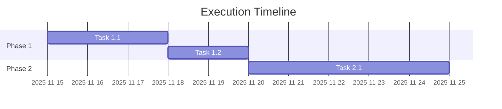

# [Plan Title]

**Status**: [Draft | In Progress | Completed | Blocked]
**Owner**: [Team/Person/Role]
**Created**: YYYY-MM-DD
**Target Completion**: YYYY-MM-DD
**Last Updated**: YYYY-MM-DD

---

## Objective

[Single, clear, measurable objective that defines what success looks like]

---

## Success Criteria

Completion requires ALL of the following:

- [ ] **Criterion 1**: [Specific, measurable outcome]
- [ ] **Criterion 2**: [Specific, measurable outcome]
- [ ] **Criterion 3**: [Specific, measurable outcome]

---

## Context & Background

### Problem Statement

[What problem are we solving? Why now?]

### Current State

[Where are we today?]

### Desired State

[Where do we want to be?]

### Motivation

[Why is this important? Business value, technical debt reduction, etc.]

---

## Detailed Tasks

### Phase 1: [Phase Name]

**Goal**: [What this phase achieves]

- [ ] **Task 1.1**: [Description]
  - Owner: [Person]
  - Estimated effort: [Hours/Days]
  - Dependencies: [None | Task X.Y]

- [ ] **Task 1.2**: [Description]
  - Owner: [Person]
  - Estimated effort: [Hours/Days]
  - Dependencies: [None | Task X.Y]

### Phase 2: [Phase Name]

**Goal**: [What this phase achieves]

- [ ] **Task 2.1**: [Description]
  - Owner: [Person]
  - Estimated effort: [Hours/Days]
  - Dependencies: [Task 1.1]

---

## Dependencies

### Internal Dependencies

- **Dependency 1**: [Description] - [Status]
- **Dependency 2**: [Description] - [Status]

### External Dependencies

- **Dependency 3**: [Third-party service, library, etc.] - [Status]

### People/Skills Required

- **Skill 1**: [Python backend development] - [Available | Need to acquire]
- **Skill 2**: [Kubernetes administration] - [Available | Need to acquire]

---

## Risks & Mitigations

| Risk | Probability | Impact | Mitigation Strategy | Owner |
|------|-------------|--------|---------------------|-------|
| [Risk description] | Low/Med/High | Low/Med/High | [How we'll handle it] | [Person] |
| Example: Team bandwidth | Medium | Medium | Prioritize critical tasks, defer nice-to-haves | PM |

---

## Timeline & Milestones

### Key Milestones

| Milestone | Date | Description |
|-----------|------|-------------|
| **M1: Phase 1 Complete** | YYYY-MM-DD | [What's delivered] |
| **M2: Phase 2 Complete** | YYYY-MM-DD | [What's delivered] |
| **M3: Final Delivery** | YYYY-MM-DD | [Full objective achieved] |

---

## Resources Required

### Budget

- Infrastructure: $X/month
- Tools/Services: $Y one-time
- **Total**: $Z

### Time Investment

- Developer hours: X hours
- Review/QA hours: Y hours
- **Total**: Z hours

---

## Progress Tracking

### Links

- **GitHub Project**: [Link to project board]
- **Related Issues**: #123, #456
- **Slack Channel**: #project-name
- **Meeting Notes**: [Link to shared doc]

### Updates

#### YYYY-MM-DD

- **Progress**: [What was completed]
- **Blockers**: [Any issues]
- **Next Steps**: [What's coming]

---

## Communication Plan

### Stakeholders

| Stakeholder | Role | Update Frequency |
|-------------|------|------------------|
| [Name] | Sponsor | Weekly |
| [Team] | Contributors | Daily standup |
| [Person] | Reviewer | On PR |

### Reporting

- **Daily**: Progress in Slack #channel
- **Weekly**: Summary in team meeting
- **Monthly**: Executive summary

---

## Definition of Done

This plan is complete when:

1. All success criteria are met
2. All tasks are checked off
3. Documentation is updated
4. Tests are passing
5. Code is reviewed and merged
6. Stakeholders have signed off

---

## Lessons Learned

[To be filled upon completion]

### What Went Well

- [Success 1]
- [Success 2]

### What Could Be Improved

- [Challenge 1]
- [Challenge 2]

### Recommendations for Future

- [Recommendation 1]
- [Recommendation 2]

---

## References

- **Related ADRs**: [ADR-XXXX](../adr/ADR-XXXX.md)
- **Related Specs**: [Spec Name](../specs/features/feature.spec.md)
- **External Resources**: [Link to article, documentation, etc.]
